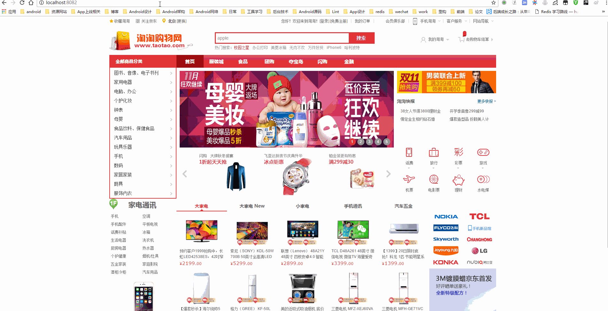

# TaoTaoShop
电商类项目,仿写京东商城

## 效果预览



## 技术栈
`SSM` + `Maven`+ `MySQL`

`Redis` + `Solr` + `Nginx`

`Docker`(TODO)

`JQuery` + `EasyUI`

`BootStrap` + `vue`(TODO)

## 功能列表
### 商品管理
- [x] 新增商品
- [x] 查询商品
- [x] 规格参数

### 网站内容管理
- [x] 内容分类管理
- [x] 内容管理

---

### 前端系统需求(TODO)

## 目录结构
```
|
|—— doc 文档
|—— gif GIF图
|—— taotao-common 基础工程
|—— taotao-manager 后台管理工程
|—— taotao-mapping MyBatis逆向工程
|—— taotao-portal 前台工程
|—— taotao-rest	服务层
|—— taotao-sso	单点登录


```
## 系统架构图

## 网络拓补图


## Tips
本项目视频来自网络,感谢他人分享 


Developed By
===

 * Jiahao Lu - <lujiahao0708@gmail.com>


License
===

    Copyright (C) 2017 Jiahao Lu <lujiahao0708@gmail.com>

    Licensed under the Apache License, Version 2.0 (the "License");
    you may not use this file except in compliance with the License.
    You may obtain a copy of the License at

       http://www.apache.org/licenses/LICENSE-2.0

    Unless required by applicable law or agreed to in writing, software
    distributed under the License is distributed on an "AS IS" BASIS,
    WITHOUT WARRANTIES OR CONDITIONS OF ANY KIND, either express or implied.
    See the License for the specific language governing permissions and
    limitations under the License.